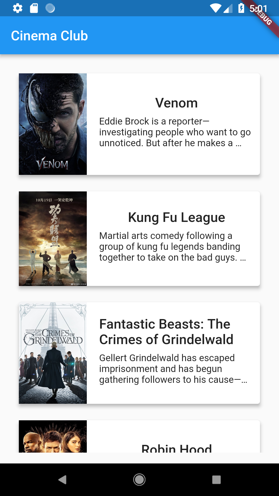

# Resume

Movie details app done in flutter

## Why did i do it ?
  Improve my skils :)
  
## Steps to clone
- git clone https://github.com/guilhermebpereira/flutter-cinema.git <br>
- at the /lib/constants.dart add your The Movie Database api key, like this:
```
const String apiKey = '[your_api_over_here]';
```

## Screenshots


